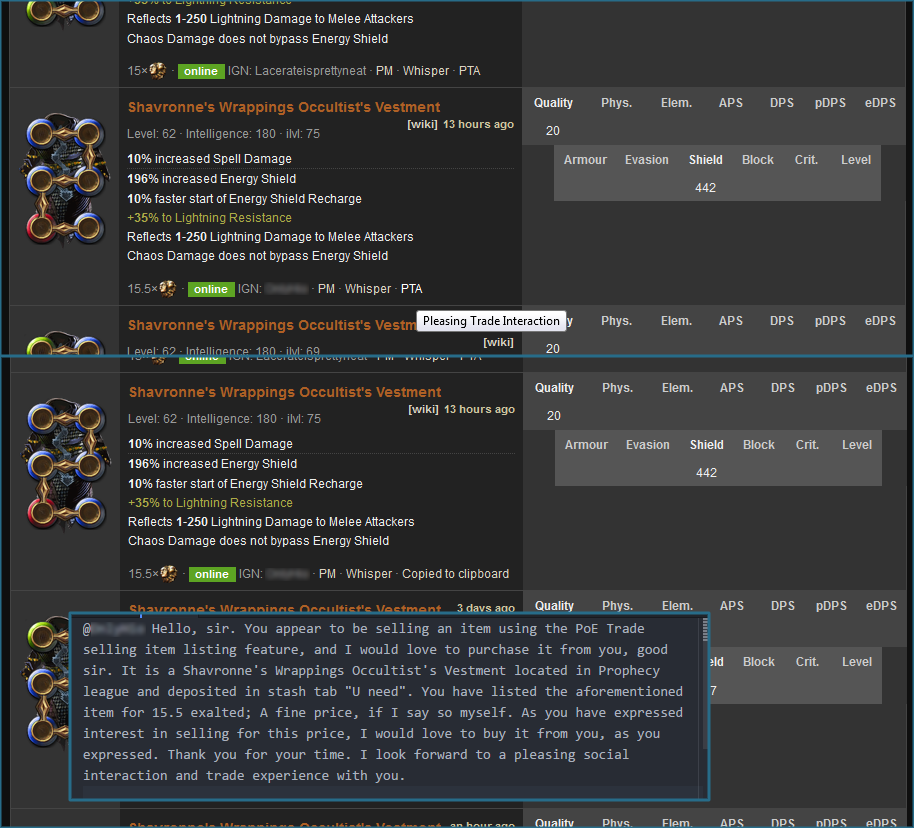

Path of Exile :tophat: Pleasing Social Interaction :tophat: UserScript
=====================================================
As a response to the express interest demonstrated by the distinguished ladies and gentlemen in [this Reddit thread](https://www.reddit.com/r/pathofexile/comments/4ql0z9/ziggyds_pleasing_social_interaction_and_trade/), I felt a remedy to the situation ought to be available at once.

This is a simple user script that adds the critical functionality of handling the formalities of trading correspondence in a most proper and appropriate way to [poe.trade](http://poe.trade).

Usage
-------
This is a User Script. You need to add it to your [Greasemonky](https://addons.mozilla.org/en-US/firefox/addon/greasemonkey/) for Firefox or a similar plug-in for your browser.

Installation
------------
Open [the script](https://github.com/concacid/PoE-PleasingTradeInteraction/raw/master/PleasingTradeInteraction.user.js) in your browser and you should get the install prompt from your user script handling plug-in.

